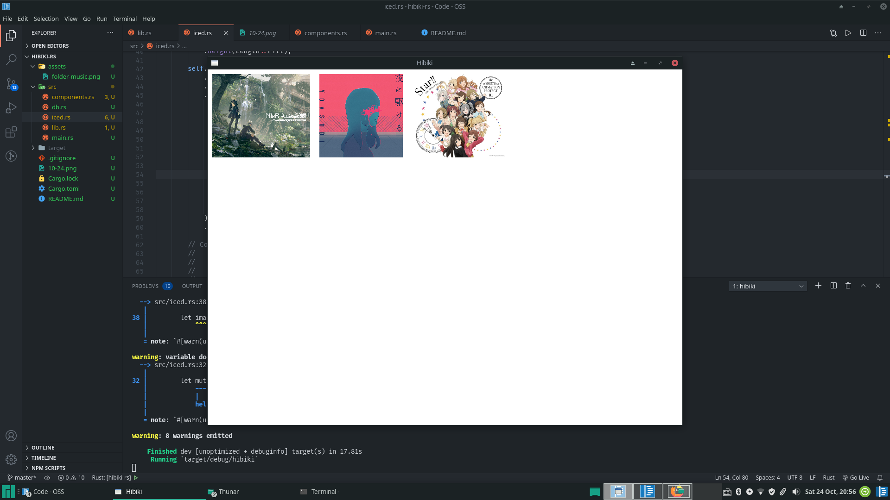

# Hibiki: Music Management Tool & Player Written in Rust

[Sony Media Go](https://www.wikiwand.com/en/Media_Go) was the only music management tool that met my needs. However, it's only on Windows and discontinued.

I love iTunes/Apple Music's UI, but it sucks when it comes to local music management:

- You need to import/export (I want to specify a few serach paths and let it update automatically)
- Changes (e.g. edits of the metadata) are not in-place (because you need import/export)
- No lossless audio (WAV/FLAC) support

That's why I'm building this application. Originally I wanted to do it with Node.js+Vue+Electron+Quasar due to the appealing UI, but it turns out to be extremely difficult to debug.

This project is in very early development, and I have no experience in GUI programming (and there aren't many Rust GUI projects out there), so do not expect Hibiki to be usable anytime soon.

Please don't hesitate to give comments on how to structure this project by opening an issue, or you can make a PR. If you happen to be enthusiastic about his project and are experienced in GUI programming, **I can transfer the ownership to you**.

## So what's the currect status

Find all mp3 files containted in specified directories, parse their id3v2 tags, and display album cover images.

## So how do I reproduce the screenshots shown above

- Have `sqlite3` installed
- set the `HIBIKI_DIRS` enviornmental variable, for example by appending `export HIBIKI_DIRS=$HOME/Music:/path/to/another/dir` to `~/.bashrc`
- Clone and `cd` to this repository and `cargo run`

## Challenges

- Performance of **iced**:
  - [it re-renders upon any event even if it's not registered](https://github.com/hecrj/iced/issues/579)
- Capability of **iced**:
  - no layers
  - no animations